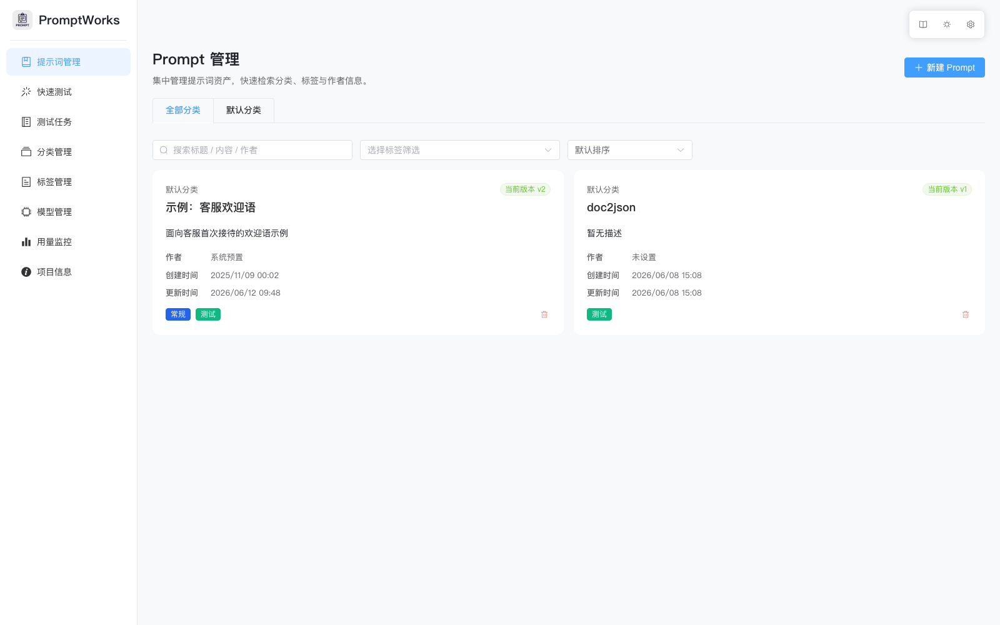
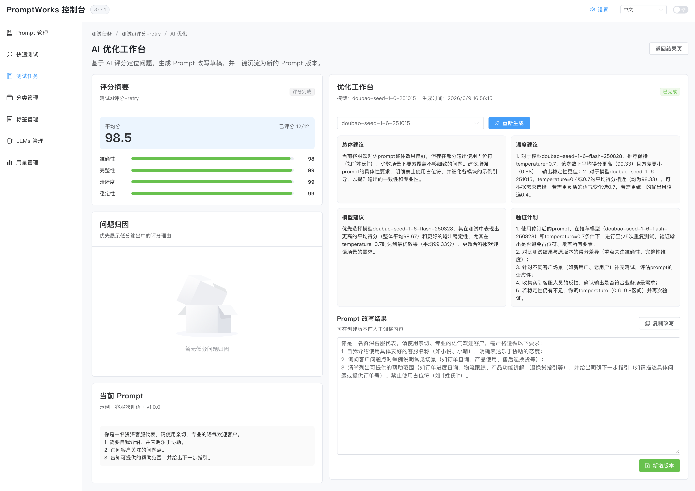



中文 | [English](docs/README_en.md) | [更新记录](CHANGELOG.md)

# PromptWorks：面向团队的 Prompt 评估与优化工作台

PromptWorks 是一个聚焦 Prompt 资产管理、批量评估与 AI 优化的全栈解决方案，仓库内包含 FastAPI 后端与 Vue + Element Plus 前端。它帮助团队把 Prompt 从“写完就用”的零散文本，沉淀为可版本化、可测试、可评分、可持续优化的智能资产。

平台围绕一条完整工作流设计：**管理 Prompt → 配置测试任务 → 运行多模型/多版本评估 → AI 评分诊断 → 生成优化建议 → 沉淀为新版本**。无论是客服话术、信息抽取、智能问答还是内部业务助手，都可以用同一套流程持续验证和改进提示词质量。



## ✨ 核心能力
- **AI 评分与优化**：对测试输出进行百分制评分，展示准确性、完整性、清晰度、稳定性等维度分，并基于评分理由生成 Prompt 改写、参数建议、模型建议和验证计划。
- **Embedding 语义分析**：按测试单元和变量组合计算语义一致性/多样性指标，在报告中展示可比较组、样本不足组和离群样本，并为 AI 优化提供额外参考。
- **Prompt 全生命周期管理**：支持提示词创建、版本迭代、标签归类、作者信息与审计记录，让团队可以追踪每一次 Prompt 变更。
- **批量评估测试**：围绕 Prompt 版本、模型、参数集与测试样本生成最小测试单元，支持多轮运行、结果对比与进度追踪。
- **版本对比与沉淀**：提供版本差异视图，并可将 AI 优化工作台中的改写草稿一键保存为新的 Prompt 版本。
- **模型运营与用量监控**：集中管理大模型供应商、模型配置与调用记录，支持对话模型与 Embedding 模型的基础配置，为模型选择、成本评估和 A/B 实验提供依据。

## 🧠 AI 评估与优化闭环

PromptWorks 新版重点强化了 AI 评估和自动优化能力。你可以先创建测试任务，让不同 Prompt 版本、不同模型或不同参数组合跑出真实输出；随后使用指定评估模型逐条打分，系统会汇总平均分、维度分、评分理由和低分问题。对于同一测试单元下的同变量组合，平台还会结合 embedding 结果计算语义一致性/多样性指标，并在报告中单独展示。进入独立的 AI 优化工作台后，平台会把评分结果与语义分析结果一起作为参考，生成更具体的改写建议，而不是只给一个笼统结论。

这个闭环特别适合处理“Prompt 看起来差不多，但线上效果不稳定”的场景：团队可以看到到底是准确性不足、信息遗漏、表达不清，还是某个模型/参数组合更容易波动；再把优化后的 Prompt 草稿、参数建议和验证计划继续带回下一轮测试。

- **评分诊断**：按输出逐条记录总分、维度分与评分理由，方便定位具体失败原因。
- **语义分析**：展示同变量组合内的语义一致性、多样性、离群样本与样本不足情况，帮助区分“稳定”与“发散”两类目标。
- **优化建议**：自动生成总体建议、参数建议、模型建议与后续验证计划。
- **Prompt 改写**：给出可编辑的 Prompt 改写结果，并支持复制或沉淀为新版本。
- **持续迭代**：用同一任务链路对比优化前后表现，减少依赖主观感觉调 Prompt 的成本。

### AI 评分与优化工作台


## 🎯 适用场景
- **团队 Prompt 资产管理**：统一维护业务提示词、版本记录和协作信息，避免散落在文档、聊天记录或个人脚本里。
- **Prompt 改版回归测试**：在发布新版本前批量比较旧版与新版输出，降低改动带来的质量风险。
- **模型选型与参数调优**：用同一批样本横向比较不同模型、温度、Top-P 等配置的稳定性与质量。
- **质量复盘与优化沉淀**：把评分理由、优化建议和验证计划沉淀到版本迭代流程中，让 Prompt 优化可解释、可复现。

## 🧱 技术栈
- **后端**：Python 3.10+、FastAPI、SQLAlchemy、Alembic、Redis、Celery。
- **前端**：Vite、Vue 3（TypeScript）、Vue Router、Element Plus。
- **工具链**：uv 进行依赖与任务管理，PoeThePoet 统一开发命令，pytest + coverage 保证质量。

## 🏗️ 系统架构
- **后端服务**：位于 `app/` 目录，采用 FastAPI + SQLAlchemy 分层结构，业务逻辑集中在 `services/`。
- **数据库与消息组件**：默认使用 PostgreSQL 与 Redis，可按需扩展 Celery 任务队列能力。
- **前端应用**：`frontend/` 目录基于 Vite 构建，提供 Prompt 管理与测试的交互界面。
- **统一配置**：通过根目录 `.env` 与前端 `VITE_` 前缀环境变量解耦各环境差异。

## 🚀 快速开始
### 通过 Docker 部署（推荐）
#### 1. **全栈一键启动**（默认拉取 main 渠道镜像）：
```bash
docker compose pull backend frontend
docker compose up -d
```

- Compose 默认引用 `yellowseaa/promptworks:backend-main-latest` 与 `yellowseaa/promptworks:frontend-main-latest`，会自动启动 PostgreSQL 与 Redis。
- 若想切换到 dev 渠道或指定具体版本，可在 `.env` 中设置 `BACKEND_IMAGE`、`FRONTEND_IMAGE`，或在命令前临时注入：  
`BACKEND_IMAGE=yellowseaa/promptworks:backend-dev-latest FRONTEND_IMAGE=yellowseaa/promptworks:frontend-dev-latest docker compose up -d`

#### 2. **仅运行后端**：需要单独调试 FastAPI 服务时，可直接拉取后端镜像：
```bash
docker pull yellowseaa/promptworks:backend-main-latest
docker run -d --name promptworks-backend -p 8000:8000 yellowseaa/promptworks:backend-main-latest
```
> 自建部署时如需自定义域名、HTTPS 或前端 API 地址，可 fork 后通过新的标签重新构建推送。

#### 3. **访问入口**

前端服务默认暴露在 `http://localhost:18080`，后端 API 为 `http://localhost:8000/api/v1`，数据库与 Redis 对应端口分别为 `15432` 与 `6379`。

#### 4. **停止/清理**：
```bash
docker compose down            # 停止容器
docker compose down -v         # 停止并删除数据卷
```

#### 5. **容器编排说明**

| 服务 | 说明 | 端口 | 额外信息 |
| --- | --- | --- | --- |
| `postgres` | PostgreSQL 数据库 | 15432 | 默认账户、密码、库名均为 `promptworks` |
| `redis` | Redis 缓存/消息队列 | 6379 | 已启用 AOF，适合作为开发环境使用 |
| `backend` | FastAPI 后端 | 8000 | 启动前自动执行 `alembic upgrade head` 同步结构 |
| `frontend` | Nginx 托管的前端静态文件 | 18080 | 构建时可通过 `VITE_API_BASE_URL` 定制后端地址 |

> 提示：如需自定义端口或数据库密码，可在 `docker-compose.yml` 中调整对应环境变量与端口映射（当前示例采用 `15432`、`18080`），然后重新执行 `docker compose up -d`。
>
> ⚠️ Apple Silicon / ARM 设备：CI 默认将 `backend-*-latest` 与 `frontend-*-latest` 镜像发布为 `linux/amd64 + linux/arm64` 多架构 manifest，可直接拉取使用；若你自行构建镜像，请使用 `docker buildx build --platform linux/amd64,linux/arm64 ... --push`，否则 ARM 主机会提示 `no matching manifest for linux/arm64`。

### 通过本地代码启动

#### 1. 环境准备
- Python 3.10+
- Node.js 18+
- PostgreSQL、Redis（生产环境推荐）；本地可参考 `.env.example` 使用默认参数快速启动。

#### 2. 后端环境初始化
```bash
# 同步后端依赖（包含开发工具）
uv sync --extra dev

# 初始化环境变量
cp .env.example .env

# 首次运行请先创建数据库与账号（以本地 postgres 超级用户为例）
createuser promptworks -P            # 若已存在同名用户可跳过
createdb promptworks -O promptworks
# 或执行以下 SQL：
# psql -U postgres -c "CREATE USER promptworks WITH PASSWORD 'promptworks';"
# psql -U postgres -c "CREATE DATABASE promptworks OWNER promptworks;"

# 同步数据库结构
uv run alembic upgrade head
```

#### 3. 前端依赖安装
```bash
cd frontend
npm install
```

#### 4. 启动服务
```bash
# 后端 FastAPI 调试服务
uv run poe server

# 在新终端中启动前端开发服务器
cd frontend
npm run dev -- --host
## 或者
uv run poe frontend
```
后端默认运行在 `http://127.0.0.1:8000`（API 文档访问 `/docs`），前端默认运行在 `http://127.0.0.1:5173`。

#### 5. 常用质量校验
```bash
uv run poe format      # 统一代码风格
uv run poe lint        # 静态类型检查
uv run poe test        # 单元与集成测试
uv run poe test-all    # 顺序执行上述三项

# 在 frontend 目录执行构建生产包
npm run build
```

## 🧪 测试任务消息约定
- 若测试任务的 Schema 未显式提供 `system` 消息，平台会把当前 Prompt 快照以 `user` 角色注入消息列表，兼容仅识别用户输入的模型。
- Schema 中若包含 `system` 消息，则保持原有顺序，不会重复注入快照内容。
- 仍会保证测试输入（`inputs`/`test_inputs`）中的问题作为后续 `user` 消息发送，支持多轮回放。

## ⚙️ 环境变量说明
| 名称 | 是否必填 | 默认值 | 说明 |
| --- | --- | --- | --- |
| `APP_ENV` | 否 | `development` | 控制当前运行环境，用于日志等差异化配置。 |
| `APP_TEST_MODE` | 否 | `false` | 启用后输出 DEBUG 级别日志，建议仅在本地调试使用。 |
| `API_V1_STR` | 否 | `/api/v1` | 后端 API 的版本前缀。 |
| `PROJECT_NAME` | 否 | `PromptWorks` | 系统显示名称。 |
| `DATABASE_URL` | 是 | `postgresql+psycopg://...` | PostgreSQL 连接串，必须保证数据库可访问。 |
| `REDIS_URL` | 否 | `redis://localhost:6379/0` | Redis 连接地址，可用于缓存或异步任务。 |
| `BACKEND_CORS_ORIGINS` | 否 | `http://localhost:5173` | 允许跨域访问的前端地址，可用逗号分隔多个 URL。 |
| `BACKEND_CORS_ALLOW_CREDENTIALS` | 否 | `true` | 控制是否允许携带 Cookie 等认证信息。 |
| `OPENAI_API_KEY` | 否 | 空 | 集成 OpenAI 模型时填写对应密钥。 |
| `ANTHROPIC_API_KEY` | 否 | 空 | 集成 Anthropic 模型时填写对应密钥。 |
| `VITE_API_BASE_URL` | 前端必填 | `http://127.0.0.1:8000/api/v1` | 前端访问后端的基础地址，需写入 `frontend/.env.local`。 |

> 提示：复制 `.env.example` 为 `.env` 后，可在 `frontend/.env.example`（待创建）或 `.env.local` 中设置 `VITE_` 开头的变量，使得构建与运行环境保持一致。

## 🗂️ 项目结构
```
.
├── alembic/                # 数据库迁移脚本
├── app/                    # FastAPI 应用主体
│   ├── api/                # REST 接口定义与依赖注入
│   ├── core/               # 配置、日志、跨域等基础设施
│   ├── db/                 # 数据库会话与初始化
│   ├── models/             # SQLAlchemy 模型
│   ├── schemas/            # Pydantic 序列化模型
│   └── services/           # 业务服务封装
├── frontend/               # Vue 3 前端工程
│   ├── public/
│   ├── src/
│   │   ├── api/            # HTTP 客户端与请求封装
│   │   ├── router/         # 路由配置
│   │   ├── types/          # TypeScript 类型定义
│   │   └── views/          # 页面组件
├── tests/                  # pytest 用例
├── pyproject.toml          # 后端依赖与任务配置
├── README.md               # 项目说明文档
└── .env.example            # 环境变量模板
```

## 📡 API 与前端联动
- 后端提供 `/api/v1/prompts`、`/api/v1/prompt-test`、`/api/v1/llms`、`/api/v1/analysis` 等接口，支撑 Prompt 管理、测试任务、AI 评分、语义分析、优化建议与模型配置等核心流程。
- 前端已接入 Prompt 详情、版本对比、测试任务结果、AI 评分与 AI 优化工作台，形成从 Prompt 创建到测试、诊断、改写和新增版本的端到端闭环。
- 测试任务列表默认展示新版任务入口，任务结果页统一承载测试输出、AI 评分入口、语义分析摘要与优化入口。

## 🤝 贡献指南
1. 新建功能分支，遵循“格式化 → 类型检查 → 测试”工作流。
2. 开发完成后运行 `uv run poe test-all` 确保质量基线。
3. 提交 Pull Request，并在描述中说明变更范围与验证方式；本地提交信息建议使用简短中文描述。

欢迎提出 Issue 或改进建议，共建 PromptWorks！

## Star History

[](https://www.star-history.com/#YellowSeaa/PromptWorks&type=date&legend=top-left)
