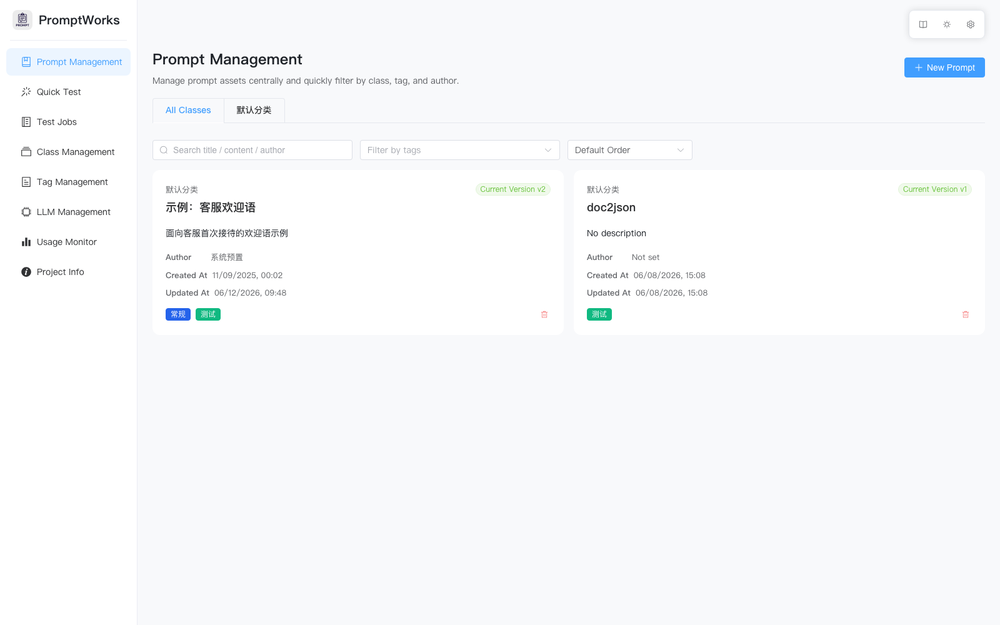
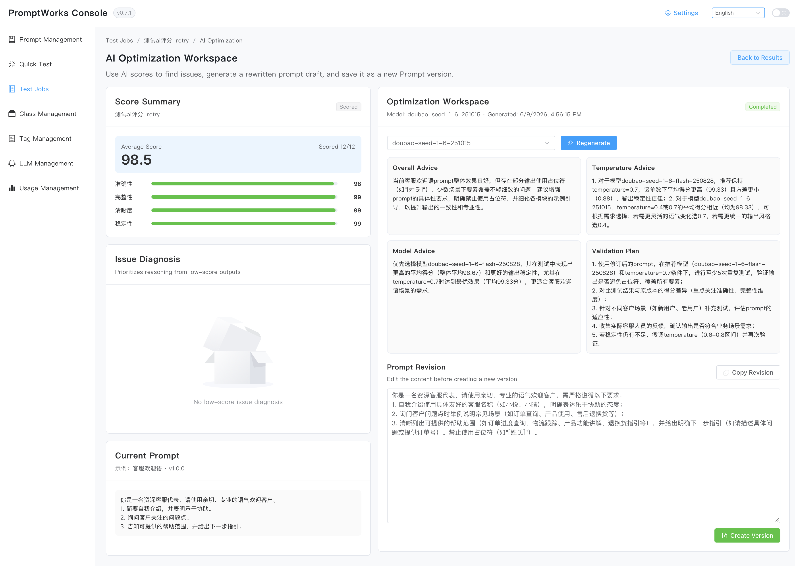

[中文](../README.md) | English | [Update](UPDATES.md)

# PromptWorks Overview

PromptWorks is a full-stack solution focused on prompt asset management and large-model operations. The repository hosts a FastAPI backend together with a Vue + Element Plus frontend. The platform supports full prompt lifecycle management, model configuration, version comparison, and evaluation experiments, providing teams with a unified collaboration and testing workbench.



## ✨ Core Capabilities
- **Prompt Management**: Create prompts, iterate versions, organize them with tags, and retain a complete audit trail.
- **Version Comparison**: Provide diff views to quickly identify content changes introduced by prompt updates.
- **Model Operations**: Centrally manage available model services and invocation quotas to support A/B experiments.
- **AI Scoring & Optimization**: Score test outputs on a 0-100 scale, summarize dimension scores and reasoning, then use the dedicated optimization workspace to generate prompt revisions and save them as new versions.
- **Evaluation & Testing**: Expose experiment execution and metric recording capabilities on the backend, while the frontend ships with pre-configured testing panels ready for integration.

### AI Scoring & Optimization Workspace


## 🧱 Tech Stack
- **Backend**: Python 3.10+, FastAPI, SQLAlchemy, Alembic, Redis, Celery.
- **Frontend**: Vite, Vue 3 (TypeScript), Vue Router, Element Plus.
- **Tooling**: `uv` for dependency and task management, PoeThePoet for unified commands, pytest + coverage for quality assurance.

## 🏗️ Architecture
- **Backend Service**: Lives under `app/`, follows a FastAPI + SQLAlchemy layered structure with business logic encapsulated in `services/`.
- **Database & Messaging**: Defaults to PostgreSQL and Redis, with optional Celery task queue capabilities.
- **Frontend Application**: Located in `frontend/`, built with Vite to deliver prompt management and testing experiences.
- **Unified Configuration**: Uses the root `.env` and front-end `VITE_` environment variables to decouple environment-specific settings.

## 🚀 Quick Start
### Docker Deployment (Recommended)
#### 1. Full-stack bootstrap (defaults to the `main` channel images)
```bash
docker compose pull backend frontend
docker compose up -d
```
- The compose file references `yellowseaa/promptworks:backend-main-latest` and `yellowseaa/promptworks:frontend-main-latest` and automatically starts PostgreSQL plus Redis.
- To switch to the dev channel or a pinned version, set `BACKEND_IMAGE` / `FRONTEND_IMAGE` in `.env` or inline:  
  `BACKEND_IMAGE=yellowseaa/promptworks:backend-dev-latest FRONTEND_IMAGE=yellowseaa/promptworks:frontend-dev-latest docker compose up -d`

#### 2. Backend only
Useful when debugging the API without the frontend:
```bash
docker pull yellowseaa/promptworks:backend-main-latest
docker run -d --name promptworks-backend -p 8000:8000 yellowseaa/promptworks:backend-main-latest
```
> For custom domains, HTTPS, or API endpoints, fork and rebuild with new tags before pushing.

#### 3. Access endpoints
Frontend: `http://localhost:18080`  
Backend API: `http://localhost:8000/api/v1`  
PostgreSQL / Redis ports: `15432` / `6379`

#### 4. Stop / clean up
```bash
docker compose down
docker compose down -v   # remove volumes (data will be lost)
```

#### 5. Service overview
| Service | Description | Port | Extra Info |
| --- | --- | --- | --- |
| `postgres` | PostgreSQL database | 15432 | Default user, password, and database are `promptworks`. |
| `redis` | Redis cache / message broker | 6379 | AOF enabled, suitable for development usage. |
| `backend` | FastAPI backend | 8000 | Runs `alembic upgrade head` before serving traffic. |
| `frontend` | Nginx-hosted frontend assets | 18080 | Use `VITE_API_BASE_URL` to point to custom backend endpoints. |

> Tip: customize ports or credentials by editing `docker-compose.yml` and rerun `docker compose up -d`.
>
> ⚠️ Apple Silicon / ARM hosts: the CI pipeline already publishes `backend-*-latest` and `frontend-*-latest` as `linux/amd64 + linux/arm64` manifests, so you can pull them directly. When building custom images, remember to run `docker buildx build --platform linux/amd64,linux/arm64 ... --push`; otherwise Arm machines will hit `no matching manifest for linux/arm64`.

### Local Development From Source
#### 1. Prerequisites
- Python 3.10+
- Node.js 18+
- PostgreSQL and Redis (recommended for production); for local development, refer to `.env.example` for default parameters.

#### 2. Backend setup
```bash
# Sync backend dependencies (including development tools)
uv sync --extra dev

# Initialize environment variables
cp .env.example .env

# Create the database and user if not already present (assuming postgres superuser)
createuser promptworks -P            # Skip if the role already exists
createdb promptworks -O promptworks
# Or execute the following SQL:
# psql -U postgres -c "CREATE USER promptworks WITH PASSWORD 'promptworks';"
# psql -U postgres -c "CREATE DATABASE promptworks OWNER promptworks;"

# Apply database migrations
uv run alembic upgrade head
```

#### 3. Frontend dependencies
```bash
cd frontend
npm install
```

#### 4. Launch services
```bash
# Start the FastAPI development server
uv run poe server

# Start the frontend dev server in a new terminal
cd frontend
npm run dev -- --host
## Alternatively
uv run poe frontend
```
The backend runs at `http://127.0.0.1:8000` (API docs at `/docs`), while the frontend runs at `http://127.0.0.1:5173`.

#### 5. Common quality checks
```bash
uv run poe format      # Enforce code style
uv run poe lint        # Static type checking
uv run poe test        # Unit and integration tests
uv run poe test-all    # Run the three commands sequentially

# Build production assets from the frontend directory
npm run build
```

## 🧪 Test Message Rules
- When a test run schema does not declare a `system` message, the platform injects the current prompt snapshot as a `user` message so providers that only honor user turns keep working.
- If a schema already includes a `system` role, we preserve the original order and do not duplicate the snapshot.
- Entries from `inputs`/`test_inputs` are still appended as subsequent `user` messages to support multi-run playback.

## ⚙️ Environment Variables
| Name | Required | Default | Description |
| --- | --- | --- | --- |
| `APP_ENV` | No | `development` | Controls the current environment, e.g., for logging. |
| `APP_TEST_MODE` | No | `false` | Emits DEBUG-level logs when enabled; recommended only for local debugging. |
| `API_V1_STR` | No | `/api/v1` | API version prefix. |
| `PROJECT_NAME` | No | `PromptWorks` | Display name of the system. |
| `DATABASE_URL` | Yes | `postgresql+psycopg://...` | PostgreSQL connection string; must point to an accessible database. |
| `REDIS_URL` | No | `redis://localhost:6379/0` | Redis connection URL for cache or async tasks. |
| `BACKEND_CORS_ORIGINS` | No | `http://localhost:5173` | Comma-separated list of allowed CORS origins. |
| `BACKEND_CORS_ALLOW_CREDENTIALS` | No | `true` | Controls whether cookies or credentials are allowed. |
| `OPENAI_API_KEY` | No | empty | Provide the key when integrating OpenAI models. |
| `ANTHROPIC_API_KEY` | No | empty | Provide the key when integrating Anthropic models. |
| `VITE_API_BASE_URL` | Required for frontend | `http://127.0.0.1:8000/api/v1` | Base URL the frontend uses to access the backend; configure in `frontend/.env.local`. |

> Tip: After copying `.env.example` to `.env`, configure `VITE_` variables in `frontend/.env.example` (to be created) or `.env.local` so build and runtime environments stay aligned.

## 🗂️ Project Structure
```
.
├── alembic/                # Database migration scripts
├── app/                    # FastAPI application
│   ├── api/                # REST endpoints and dependency wiring
│   ├── core/               # Config, logging, CORS, and other infrastructure
│   ├── db/                 # Database session management and initialization
│   ├── models/             # SQLAlchemy models
│   ├── schemas/            # Pydantic schemas
│   └── services/           # Business service layer
├── frontend/               # Vue 3 frontend project
│   ├── public/
│   ├── src/
│   │   ├── api/            # HTTP client wrappers
│   │   ├── router/         # Routing configuration
│   │   ├── types/          # TypeScript type definitions
│   │   └── views/          # Page components
├── tests/                  # pytest suites
├── pyproject.toml          # Backend dependencies and task config
├── README.md               # Primary project documentation
└── .env.example            # Environment variable template
```

## 📡 API & Frontend Integration
- Backend exposes endpoints such as `/api/v1/prompts` and `/api/v1/test_prompt` for the frontend. The current frontend example relies on local mock data and can be switched to live APIs in upcoming iterations.
- The prompt detail view already contains a version diff component and testing panel, enabling end-to-end validation once wired to real endpoints.
- The testing task list defaults to the new task entry point, with the legacy “Create Test Task” button hidden and wording aligned to “Create Test Task” in the new flow.

## 🤝 Contribution Guidelines
1. Create a feature branch and follow the “format → type check → test” workflow.
2. Run `uv run poe test-all` to confirm the quality baseline before raising a PR.
3. Open a pull request summarizing the change scope and verification steps; keep local commit messages concise and in Chinese.

We welcome issues and suggestions—let’s build PromptWorks together!

## Star History

[](https://www.star-history.com/#YellowSeaa/PromptWorks&type=date&legend=top-left)
