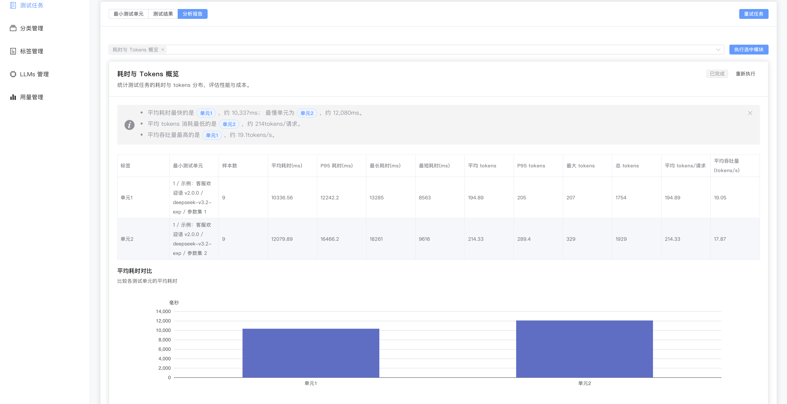

# 分析模块使用与开发教程

> 本教程面向平台开发者与维护者，总结分析模块从“任务配置 → 执行调度 → 前端呈现”的端到端流程，并给出扩展与调试指引。阅读完毕后，你应能熟练使用现有模块、实现新的分析能力，并在前后端之间完成协同验证。

## 1. 场景与目标
- **定位**：分析模块以插件化方式处理测试结果 `DataFrame`，生成表格、图表与洞察，服务于 Prompt 测试调优场景。
- **职责分界**：`app/services/analysis_modules` 用于实现业务逻辑，`app/services/analysis_registry.py` 负责注册与执行，`frontend/src/views/PromptTestTaskResultView.vue` 则承载参数输入、调度与可视化。
- **协议**：所有模块必须返回 `AnalysisResult`（见 `app/schemas/analysis_module.py`），并通过 `AnalysisModuleDefinition` 描述自身能力，以便前端动态渲染。



## 2. 用户使用流程（开发者视角）

### 2.1 创建任务时选择模块
1. 在「提示词测试创建」页（`PromptTestTaskCreateView.vue`）的“分析模块”表单中勾选需要的模块，其值会落在 `taskForm.analysisModules` 并随任务配置入库。
2. 该页面会调用 `listAnalysisModules()`（`frontend/src/api/analysis.ts`）以展示 `AnalysisModuleDefinition` 列表。
3. 构建后端任务时，可在配置 JSON 中添加 `analysis_modules` 数组以预设默认选项。


### 2.2 在结果页执行分析
1. 在「测试结果」页（`PromptTestTaskResultView.vue`）切换到“分析”页签。
2. 页面会自动载入已配置或缓存过的模块，支持多选并批量执行。
3. 每张模块卡片按 `AnalysisParameterSpec` 渲染表单，点击“执行”将触发 `executeAnalysisModule()`，携带 `module_id`、`task_id`、`target_type` 与参数。
4. 执行完成后，卡片展示：
   - `result.data` × `columns_meta` → 表格。
   - `result.extra.charts` → 预置图表，直接渲染为 ECharts。
   - `insights` 与 `extra.insight_details` → 文本及结构化洞察。


## 3. 后端结构与执行链路

### 3.1 数据模型（`app/schemas/analysis_module.py`）
- `AnalysisParameterSpec`：描述前端参数控件（类型、默认值、选项、帮助文本）。
- `AnalysisColumnMeta`：定义每列展示名、说明与支持的图表类型，驱动前端表格和图表联动。
- `AnalysisContext`：封装 `task_id`、`user_id`、`llm_client`、`metadata` 等运行时信息，便于模块内部访问任务态。
- `AnalysisResult`：模块返回的核心载体，包括 `data_frame`、`columns_meta`、`insights`、`llm_usage` 与 `extra`。
- `AnalysisModuleDefinition` & `ModuleExecutionRequest`：分别用于注册模块和描述前端发起的执行请求。

### 3.2 注册与调度（`app/services/analysis_registry.py`）
1. **注册**：启动时调用 `initialize_builtin_modules()`，由 `register_builtin_modules()` 将模块定义+处理函数写入 `AnalysisModuleRegistry`。
2. **参数校验**：`validate_parameters()` 会根据 `AnalysisParameterSpec` 自动补默认值、校验类型/枚举。
3. **字段校验**：`ensure_requirements()` 检查 `required_columns` 是否在 DataFrame 中存在，提前阻断错误。
4. **执行服务**：`AnalysisExecutionService` 提供同步 `execute_now()` 与 `schedule()`（线程池）两种模式，统一调用模块处理函数。

### 3.3 数据加载 & 转换（`app/services/analysis_runner.py`）
- `execute_module_for_test_run()`：面向传统 `TestRun`，从 `result` 表加载 `latency_ms`、`tokens_used` 等字段。
- `execute_module_for_prompt_test_task()`：针对 PromptTestTask，将 `units → experiments → outputs` 展开为 `DataFrame`，自动过滤失败输出并补齐 `unit_id`/`unit_name`。
- `serialize_analysis_result()`：把 `AnalysisResult` 转换为 JSON 友好的 `AnalysisResultPayload`，处理空值与 `pandas` 类型。

### 3.4 API 暴露（`app/api/v1/endpoints/analysis.py`）
- `GET /api/v1/analysis/modules`：直接返回注册表中的所有定义，供前端渲染列表。
- `POST /api/v1/analysis/modules/execute`：根据 `target_type` 调用对应 runner，并对异常类型映射 HTTP 状态码（404, 422, 400 等），再向前端返回序列化结果。

## 4. 编写自定义分析模块

### 4.1 Checklist
1. **设计指标**：确定输入 DataFrame 所需列、统计逻辑和输出列含义。
2. **定义 metadata**：为每列配置 `AnalysisColumnMeta`，必要时设计 `charts/unit_links/insight_details` 结构供前端使用。
3. **实现 handler**：坚持纯函数风格，输入 `(data_frame, params, context)`，返回 `AnalysisResult`。
4. **注册模块**：在 `app/services/analysis_modules/__init__.py` 中调用新的 `register_xxx_module()`，确保模块在启动阶段完成注册。
5. **测试**：编写 `pytest` 用例，覆盖参数校验、字段缺失、核心统计等路径，命令：`uv run poe test-all`。

### 4.2 样例骨架
```python
# app/services/analysis_modules/accent_rate.py
from app.schemas.analysis_module import (
    AnalysisColumnMeta, AnalysisModuleDefinition, AnalysisResult, AnalysisContext
)

MODULE_ID = "accent_rate"

def register_accent_rate_module(registry: AnalysisModuleRegistry) -> None:
    definition = AnalysisModuleDefinition(
        module_id=MODULE_ID,
        name="示例：口音识别准确率",
        description="统计不同口音样本的通过率与平均耗时。",
        parameters=[
            AnalysisParameterSpec(key="min_samples", label="最小样本数", type="number", required=False, default=5),
        ],
        required_columns=["accent", "is_correct", "latency_ms"],
        tags=["quality"],
        allow_llm=False,
    )

    def _handler(df: pd.DataFrame, params: dict[str, Any], ctx: AnalysisContext) -> AnalysisResult:
        # 1. 过滤数据
        working = df.dropna(subset=["accent"])
        # 2. groupby 计算指标
        summary = (
            working.groupby("accent")
            .agg(
                sample_count=("is_correct", "count"),
                pass_rate=("is_correct", "mean"),
                avg_latency_ms=("latency_ms", "mean"),
            )
            .reset_index()
        )
        # 3. 最终返回
        return AnalysisResult(
            data_frame=summary,
            columns_meta=[
                AnalysisColumnMeta(name="accent", label="口音"),
                AnalysisColumnMeta(name="sample_count", label="样本数", visualizable=["bar"]),
                AnalysisColumnMeta(name="pass_rate", label="通过率", visualizable=["bar", "line"]),
            ],
            insights=[],
            extra={"charts": []},
        )

    registry.replace(definition, _handler)
```

### 4.3 常见注意事项
- **列名与类型**：使用 `pd.to_numeric(..., errors="coerce")` 清洗异常值，避免 `NaN` 传播。
- **单位与标签**：若需要在 tooltip 中显示“单元标签”，可仿照 `latency_tokens_summary` 返回 `extra.unit_links`，方便前端映射。
- **LLM 能力**：准备接入 LLM 时，将 `AnalysisModuleDefinition.allow_llm` 设为 `True`，并在 handler 中使用 `context.llm_client`。
- **性能**：大数据量建议使用 `DataFrame` 向量化操作，必要时在模块内部做采样或聚合。

## 5. 前端适配指南

### 5.1 API 与类型
- `frontend/src/api/analysis.ts`：封装 `listAnalysisModules` 与 `executeAnalysisModule`。
- `frontend/src/types/analysis.ts`：需与后端 `AnalysisResultPayload` 结构保持同步，新增字段时记得扩展此处类型及使用位置。

### 5.2 运行与状态管理（`PromptTestTaskResultView.vue`）
1. `analysisModules` & `selectedAnalysisModules`：存储用户选择，并通过 `localStorage` 做缓存（`ANALYSIS_SELECTION_PREFIX`）。
2. `moduleStates`：对每个模块记录 `definition、form、status、result、charts、unitLinks` 等信息。
3. `runAnalysisModule()`：负责参数准备、调用 API、解析 `extra` 中的 `charts/unit_links/insight_details` 并渲染。
4. `charts` 渲染逻辑：
   - 若 `extra.charts` 非空，直接使用模块提供的 ECharts option。
   - 否则根据 `columns_meta.visualizable` 构造通用图表（目前支持 `bar/line/pie`），并允许用户切换维度与类型。
5. `analysisSelectionInitialized` & `autoSelectedModuleIds`：当任务已经预设模块时，前端会自动触发一次执行，便于开箱即用。

### 5.3 扩展前端展示
- **自定义洞察**：`extra.insight_details` 可添加结构化数据，前端根据 `type` 决定如何渲染；当前示例支持 `latency_comparison/tokens_peak/throughput_peak`。
- **跳转锚点**：`extra.unit_links` 可让 tooltip/标签跳回指定单元，方便在 UI 中做“定位到单元”功能。
- **错误提示**：确保后端抛出的 `ParameterValidationError`/`RequirementValidationError` 具备可读中文，前端会原样展示。

## 6. 扩展方案对比

| 方案 | 说明 | 优点 | 风险/成本 | 适用场景 |
| --- | --- | --- | --- | --- |
| A. 仓库内置模块 | 将模块写入 `analysis_modules` 并随版本迭代 | 依赖最少、测试链路清晰 | 发布需走完整 CI/CD，用户无法热更新 | 平台核心指标、通用分析 |
| B. 用户上传 `.py/.zip` | 结合 `module.yaml` 与白名单依赖动态加载 | 用户可快速试验 | 需要 Sandbox、依赖校验与安全隔离 | 客户自定义分析、PoC 验证 |
| C. LLM 驱动洞察 | 在模块中调用 `context.llm_client` 生成解释 | 输出更智能、减少手写逻辑 | 需控制成本、提示词一致性 | 总结性报告、自然语言解读 |

> 推荐做法：首先以方案 A 实现稳定的指标与协议；待协议成熟后，再增量开放方案 B/C，注意在 `AnalysisContext.metadata` 中注入必要上下文供 LLM 使用。

## 7. 调试与排障

1. **接口联调**
   - `uv run poe dev-api` 启动后端，使用 `curl` 直接调用 `/api/v1/analysis/modules` 与 `/execute`。
   - 观察日志中 `AnalysisExecutionService` 的异常栈，确认参数或字段问题。
2. **数据验证**
   - 在 `analysis_runner.py` 中临时打印 `data_frame.head()`（调试后移除），确保字段齐全。
   - 如果 `required_columns` 缺失，可在 `PromptTestTask` 的 `outputs` 中确认字段名称，并在转换逻辑中补充。
3. **前端缓存**
   - `localStorage` 中的 `prompt-test-analysis*` 键值可能导致旧数据误导测试，可通过浏览器 DevTools 清理。
4. **性能监测**
   - 大型任务建议在 handler 内记录 `context.logger` 或通过 `insights` 返回耗时信息，便于前端提示。

